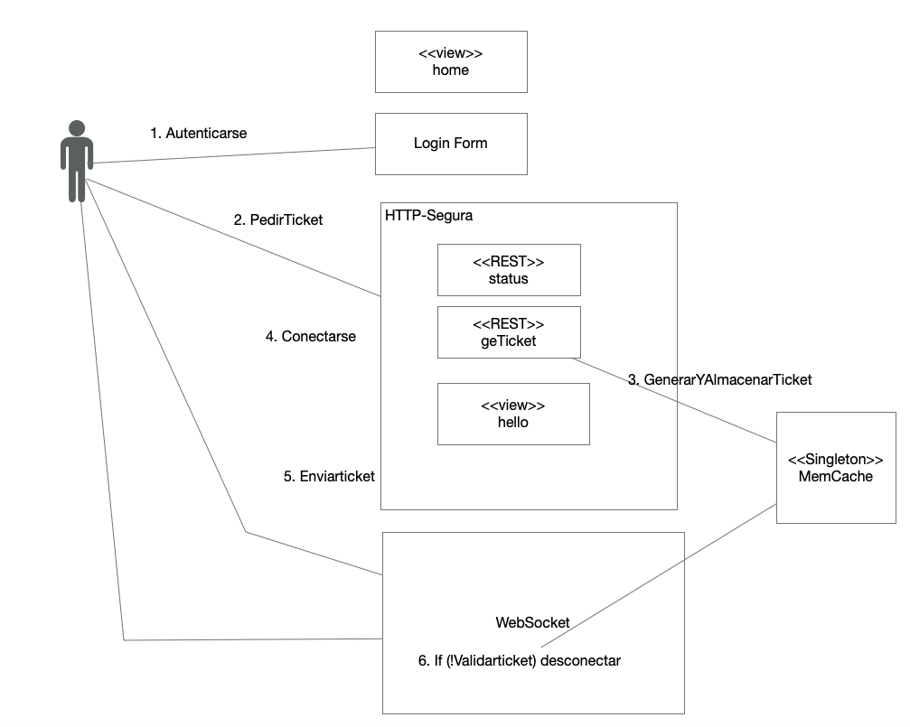

# Seguridad en aplicaciones Web y Websockets - ARSW

# app desplegada en heroku

Seguridad en aplicaciones Web y Websockets

* [Interactive Black Board Life](https://security-interactiveblackboard.herokuapp.com/)


# Prerequisitos

Tener instalado Java jdk versiones 7+, Maven comandos, git y Spring Framework

# Documentación

la documentacion de este proyecto esta en la siguiente ruta del proyecto:

```
raiz /documentation
```

# Empezar

cargue las dependencias con:

```
mvn package
```

ejecute la aplicación web con cualquiera de los dos comandos:

```
java -jar target/InteractiveBlackBoardLife-1.0-SNAPSHOT.jar
```

```
mvn spring-boot:run
```

visualize el tablero en el navegador indicando la siguiente dirección:

```
http://localhost:8080
```

# Arquitectura General

<p align="center">
    
</p>

# Built con

* [Maven](https://maven.apache.org/) - Dependency Management
* [JAVA JDK 8](http://www.oracle.com/technetwork/java/javase/overview/index.html) - construcción
* [JUnit 3.8.1](https://mvnrepository.com/artifact/junit/junit/3.8.1) - Test Dependency

* [Spring Framework 2.3.1](https://spring.io/projects/spring-framework) - Framework


# Autor

* **ANDRES DAVID VASQUEZ IBAÑEZ** - *Initial work* - [VASHIGO](https://github.com/vashigo)